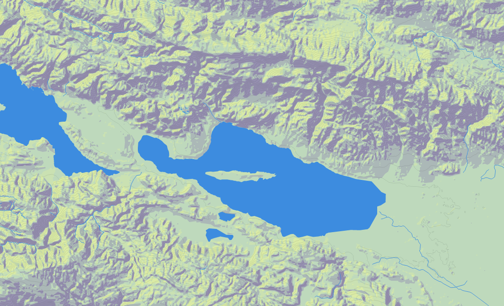

# Hoverboard

Render vector tiles on canvas with leaflet. 

[Try it out](https://summer4096.github.io/hoverboard/)

Supports:

	- [geojson](http://geojson.org/) 
	- [topojson](https://github.com/mbostock/topojson/wiki)
	- [mapbox vector tiles (protobuf)](https://github.com/mapbox/vector-tile-spec)
